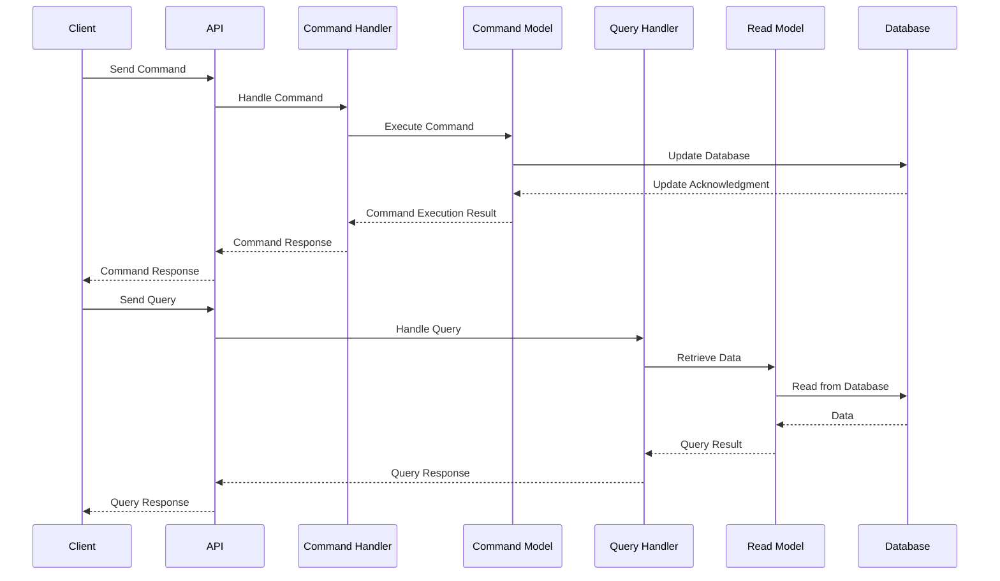

```mermaid
sequenceDiagram
  participant Client as Client
  participant API as API
  participant CommandHandler as Command Handler
  participant CommandModel as Command Model
  participant QueryHandler as Query Handler
  participant ReadModel as Read Model
  participant Database as Database

  Client ->> API: Send Command
  API ->> CommandHandler: Handle Command
  CommandHandler ->> CommandModel: Execute Command
  CommandModel ->> Database: Update Database
  Database -->> CommandModel: Update Acknowledgment
  CommandModel -->> CommandHandler: Command Execution Result
  CommandHandler -->> API: Command Response
  API -->> Client: Command Response

  Client ->> API: Send Query
  API ->> QueryHandler: Handle Query
  QueryHandler ->> ReadModel: Retrieve Data
  ReadModel ->> Database: Read from Database
  Database -->> ReadModel: Data
  ReadModel -->> QueryHandler: Query Result
  QueryHandler -->> API: Query Response
  API -->> Client: Query Response

```